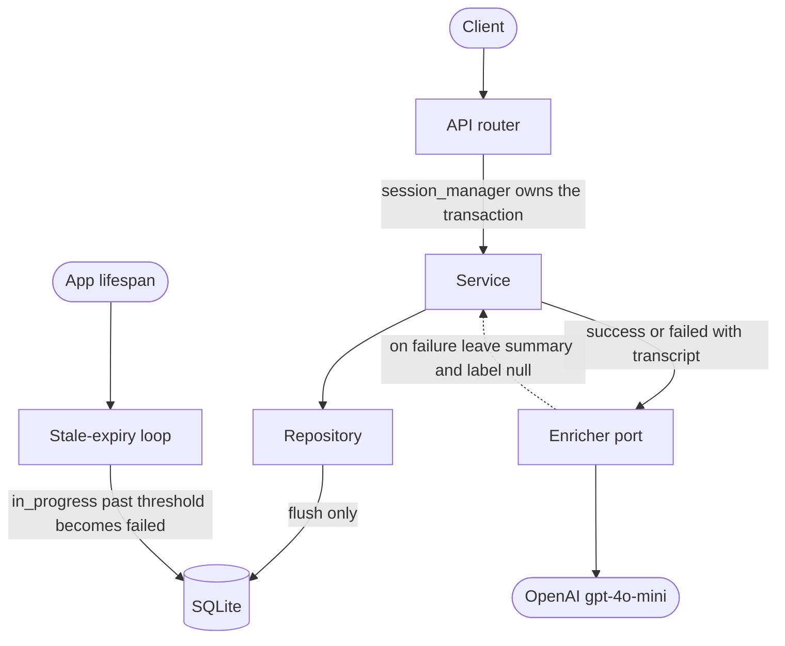

# Voico Calls Dashboard

A full-stack dashboard for phone calls: status tracking, notes, filtering and search, AI call enrichment, and auto-expiry of stale calls. FastAPI + SQLModel + SQLite on the backend, React + TypeScript on the frontend.

**All four interview tasks are complete**, each shipped as a single pull request (#1 to #4), plus a follow-up frontend hardening pass (#5). The sections below restate each task, describe what was built, and explain the decisions worth reasoning about. The commit history and PRs carry the diffs and the step-by-step reasoning.

## Solution overview

| Task | What was built | Surface | PR |
|------|----------------|---------|-----|
| 1. Call Notes | Nullable `notes` on `Call` + migration, `PATCH /api/calls/{call_id}/notes`, inline edit in the detail drawer | backend + frontend | [#1](https://github.com/christian-hawk/voico_backend/pull/1) |
| 2. Filtering & Search | Combinable filters and column sort on `GET /api/calls`; filter bar with removable chips and sortable headers | backend + frontend | [#2](https://github.com/christian-hawk/voico_backend/pull/2) |
| 3. Stale Auto-Expiry | Background lifespan job that marks stale `in_progress` calls `failed`; interval and threshold env-configurable | backend | [#3](https://github.com/christian-hawk/voico_backend/pull/3) |
| 4. Webhook AI | `POST /api/webhook/call` records the call outcome and enriches it with an OpenAI summary and label | backend | [#4](https://github.com/christian-hawk/voico_backend/pull/4) |
| Drawer hardening | Editing, layout, and live-data fixes to the call detail drawer (Task 1 and 2 follow-up) | frontend | [#5](https://github.com/christian-hawk/voico_backend/pull/5) |

## Architecture



The backend follows a layered module pattern: every feature lives under `app/modules/<name>/`, split into `router` (endpoints), `service` (business logic), `repository` (DB access), and `schema` (SQLModel tables plus request/response models), with `ai` (the OpenAI gateway) and `tasks` (the background job) as peers.

The load-bearing invariant is the **transaction boundary**. The `@session_manager` decorator wraps mutating endpoints and owns the unit of work: it commits on success and rolls back on any exception. Repositories only `flush()`; they never commit. Read endpoints are undecorated. One owner of the transaction, no scattered commits. This is what makes Task 4's failure contract necessary (below).

## Engineering practices

- **One PR per task, atomic commits.** Each task is a single PR (#1 to #4) of small conventional commits scoped to a layer (`feat(service)`, `fix(ai)`, and so on), so the history reads as the reasoning, in order.
- **A green gate is the definition of done.** Every task merges green: `pytest`, `ruff check`, `ruff format --check`, and `mypy` on the backend, plus `eslint` and `tsc` + `vite build` on the frontend.

## Task 1: Call Notes

**Requirement.** Add a nullable `notes` field to `Call` with a migration, a `PATCH /api/calls/{call_id}/notes` endpoint, and inline editing in the call detail drawer.

**Solution.** A `notes` column and Alembic migration; `PATCH /api/calls/{call_id}/notes` taking `{"notes": "..."}`; the drawer turns the notes area into a textarea on click and persists through the endpoint, syncing the row on success.

**Decisions.**
- **The API is the contract, not the client.** Input is normalized at the boundary: the note is stripped, empty becomes `null`, and it is capped at 10k characters (a longer body is a 422). The React app is one consumer; validation lives server-side so every consumer gets it.
- **`updated_at` is model-managed.** It uses `onupdate`, so any writer bumps it for free; and the service skips the write entirely when the value is unchanged, so a no-op PATCH emits no `UPDATE` at all.
- **A concurrency test pins the persistence model.** Because the webhook (Task 4) can write the same row, `test_notes_concurrency` proves a notes edit and a concurrent enrichment interleave safely: SQLAlchemy emits a column-scoped `UPDATE` (only `notes` and `updated_at`), so it is last-write-wins per column rather than per row, and the notes write never clobbers the other writer's `status`/`summary`.

A few inherited environment fixes landed first as separate scoped commits, kept out of the feature diffs. The main one is the `sqlalchemy[asyncio]` extra, since greenlet's platform marker otherwise blocks boot on macOS arm64.

## Task 2: Advanced Filtering & Search

**Requirement.** Extend `GET /api/calls` with partial name and phone match, exact label, min/max duration, and column sort; a filter bar with removable chips and clickable sortable headers, all reflected in the request in real time.

**Solution.** Optional, combinable query params ANDed with each other and the existing `status`; a debounced filter bar with one removable chip per active filter and headers that cycle ascending → descending → cleared.

**Decisions.**
- **Sort cannot be SQL-injected.** `sort_by` is a whitelist enum of the six sortable columns, so an unknown column (`created_at`, say) is a 422 by type and is never interpolated into SQL as a string. NULLs sort last in both directions, and ordering is tie-broken on `(created_at, id)`, so a single consistent ordering never duplicates a row across pages.
- **Phone search matches digits against digits.** `555 201`, `(555) 201`, and `5552014832` all find `+1 (555) 201-4832`; a term with no digits falls back to an escaped `LIKE`, and `%`/`_` are escaped so they stay literal.
- **Counts stay global under filters, on purpose.** The per-status counts reflect the whole table; only `total` reflects the active filters. Nothing in the requirement defines what counts should mean under a filter, so the simpler, unsurprising behavior is kept rather than inventing semantics (named in Trade-offs as reversible).
- Empty string, bad enum, negative duration, and `min > max` are each a 422 at the boundary.

## Task 3: Stale Call Auto-Expiry

**Requirement.** A background job that periodically marks `in_progress` calls older than a threshold as `failed` in one batch and logs the count; the interval and threshold must be env-configurable.

**Solution.** A loop started in the app lifespan: it sleeps one interval, then sweeps, flipping every `in_progress` call started before `now - threshold` to `failed` in a single `UPDATE`, setting `ended_at`, and logging how many it expired.

**Decisions.**
- **It sleeps first, then sweeps.** A fresh boot does not immediately expire the seeded `in_progress` calls (a one-interval window before the first run), so a restart never wipes the sample data the dashboard is meant to show.
- **Config is in seconds with fail-fast validation.** `STALE_EXPIRY_INTERVAL_SECONDS` and `STALE_EXPIRY_THRESHOLD_SECONDS` are in seconds (trivial to tune low for testing) and must be `>= 1`, failing at startup otherwise: `0` would busy-loop and a negative threshold would put the cutoff in the future and expire fresh calls.
- **Expiry restores the terminal-call invariant.** A failed call gets `ended_at` set (age measured from `started_at`); `duration_seconds` is left null because an abandoned call has no real duration. This keeps expired calls consistent with the ones the webhook closes. Timestamps are naive UTC to match the existing schema (see Trade-offs).
- **The cutoff is strict.** `started_at < now - threshold`, so a call exactly at the threshold is kept rather than expired, pinned by a boundary test.
- **Single-process by design** (named in Trade-offs): one in-lifespan loop, no multi-worker coordination.

## Task 4: Webhook AI Integration

**Requirement.** Implement `POST /api/webhook/call`: update the call's `status`, `duration_seconds`, `raw_transcript`, and `ended_at` and persist; then, on `success`/`failed` with a transcript, call `gpt-4o-mini` for a 2 to 3 sentence summary and a `CallLabel`, storing both. On an OpenAI failure, log and continue with `summary`/`label` left null.

**Solution.** `record_call_outcome` applies the outcome, decides whether to enrich, calls the injected enricher, and persists once. `ai.enrich_call` calls `gpt-4o-mini` with structured output (`response_format`), so the label is a valid `CallLabel` by construction.

**Decisions.**
- **It is a POST, so the event is the call's new state: full update, not PATCH.** All four fields are written from the payload. A partial "only if present" write would let a terminal `failed` event with no `ended_at` produce a closed call with no end time, inconsistent with the expiry path (Task 3), which always sets `ended_at`. Reading the requirement literally and cross-checking the rest of the system pointed to the full update.
- **Enrich on every qualifying terminal delivery; no idempotency guard.** The trigger is "status is success or failed and a transcript is present", with no "only once" clause. An enrich-once guard would leave the summary describing a stale transcript if a corrected redelivery arrived, so conformance wins; re-enriching a redelivery is the named, eyes-open cost.
- **The failure contract is a transaction-integrity requirement, not a `try/except`.** The enricher catches every OpenAI error and returns `null`; it never raises. This is required *because* of the `@session_manager` invariant: if the OpenAI call propagated, the decorator would roll back the whole transaction, including the status and transcript update that already succeeded. "Log and continue" has to absorb the failure inside the enricher for the field update to survive. Tests assert the call still persists with `summary`/`label` null both when the enricher returns null and when the client raises.
- **OpenAI is an injected gateway, not an import.** The service takes an `Enricher` port wired to the real client at the router and overridden in tests with zero network, symmetric with how the repository is injected.
- **The `openai` floor is `>= 1.92.0`.** `chat.completions.parse`, the structured-output helper this relies on, is only out of beta from `1.92.0`; an older resolution raises `AttributeError`, which the failure contract would then swallow into a silently-null enrichment. The lockfile masks this (it resolves to 2.x, where `parse` exists), so the floor was raised to state the real minimum (the floor itself is the guard), and a unit test exercises the `parse` success path.
- **The transcript is treated as untrusted input.** It is wrapped in delimiters with a system instruction not to follow instructions inside it; the `label` is already enum-bounded by structured output, so only the free-text `summary` is exposed. A proportionate mitigation, not a guarantee.

## Trade-offs & where this changes at scale

Each is a deliberate simplification kept for the current scale (an internal dashboard over ~100 calls), with the trigger that would reopen it:

- **Enrichment runs inside the request transaction.** The OpenAI call is awaited while the DB transaction is open, so the connection is held for the enrich step (bounded by the 30s OpenAI client timeout). This keeps the response contract: the webhook returns the already-enriched call. Under real throughput it would become persist-the-outcome-then-enrich-in-a-second-transaction; the single-`@session_manager`-commit boundary does not justify the extra complexity yet.
- **A new `AsyncOpenAI` client per call.** `async with` constructs and closes the client (and its `httpx` pool) each request, which avoids a never-closed global and keeps the no-key and test paths simple, at the cost of a TCP/TLS handshake per call. At volume the client would become a single instance created and closed in the lifespan.
- **Single-process stale-expiry loop.** One in-lifespan loop, no leader election; multiple workers would each run it. The move would be a single scheduler or an advisory lock.
- **Naive UTC timestamps.** The schema uses naive `datetime.utcnow()` and the code matches it for consistency; the cost is deprecation warnings on newer Python. Migrating to timezone-aware datetimes is a whole-column-set change, done at once rather than piecemeal.
- **No status state-machine.** The webhook sets `status` to whatever the event says, so an out-of-order delivery could move a terminal call backward. The requirement says "update its status," and guarding transitions is speculative for a single provider; it is a one-line guard to add if ordering guarantees are needed.
- **SQLite and no auth** are kept from the scaffold; each is a single-swap change (Postgres via the async URL, an auth dependency on the router).

## Testing

The backend is covered by **integration tests over the real ASGI app**, with a throwaway SQLite database per test, the schema applied via `alembic upgrade head` each run (so every run re-validates the migration chain), and the session and enricher swapped through dependency overrides. The choice is deliberate: these tests exercise the actual contract (routing, validation, the transaction boundary, the migration chain) instead of mocks, since unit-isolating the service would mostly test mocks of the session and repository. Unit tests are used where isolation is cheap and high-value: `enrich_call`'s parse, refusal, empty-choices, and error paths. The failure contract is pinned by `test_webhook_persists_on_openai_failure` and `test_webhook_persists_when_client_raises`, and a concurrency test covers a notes edit interleaving with webhook enrichment on the same row. The frontend is gate-checked (lint and build).

---

## Running it

### Backend

```bash
cd backend
uv sync
cp .env.example .env
uv run uvicorn app.main:app --reload --port 8000
```

The database (`db.sqlite3`) ships with the repo and already contains 100 sample calls, so no migrations or seeding are needed to start. The API is at `http://localhost:8000`; interactive docs at `http://localhost:8000/docs`.

```bash
uv run alembic upgrade head                          # apply migrations
uv run alembic revision --autogenerate -m "message"  # new migration after a model change
uv run pytest                                         # tests
uv run ruff check . && uv run mypy app                # lint + types
```

### Frontend

```bash
cd frontend
npm install
npm run dev          # http://localhost:5173
```

### Endpoints

| Method | Path | Description |
|--------|------|-------------|
| `GET` | `/api/calls` | List calls (filter, search, sort, paginate) |
| `GET` | `/api/calls/{call_id}` | Get a single call |
| `PATCH` | `/api/calls/{call_id}/notes` | Update notes on a call |
| `POST` | `/api/webhook/call` | Record a call outcome and enrich it |
| `GET` | `/health` | Health check |

### Environment variables

| Variable | Description |
|----------|-------------|
| `DATABASE_URL` | SQLite path (default `sqlite+aiosqlite:///./db.sqlite3`) |
| `OPENAI_API_KEY` | OpenAI key for Task 4 enrichment; absent disables enrichment (warned once at startup) |
| `STALE_EXPIRY_INTERVAL_SECONDS` | Seconds between stale-call sweeps (default `600`) |
| `STALE_EXPIRY_THRESHOLD_SECONDS` | Age after which an `in_progress` call is marked `failed` (default `1800`) |
| `VITE_API_URL` | Frontend API base URL (default `http://localhost:8000`) |

The backend is fully async; CORS is open and there is no authentication (a demo project).
